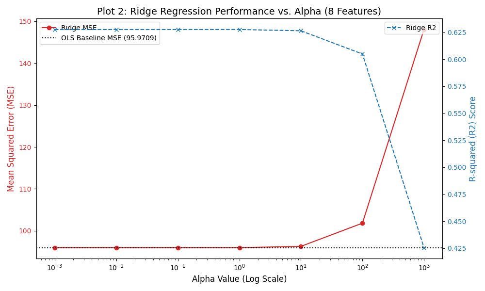
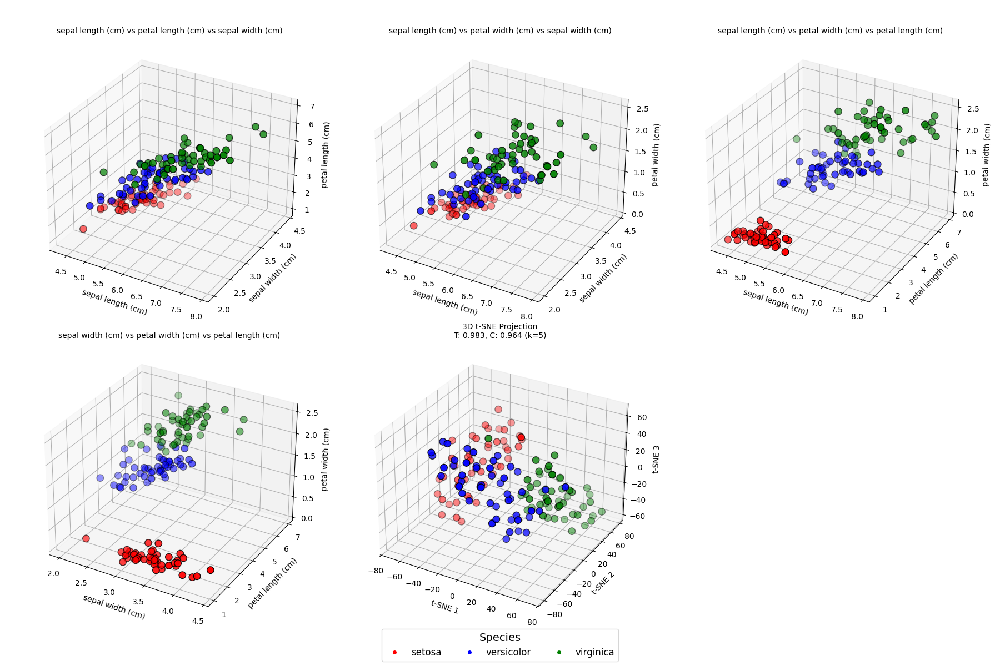
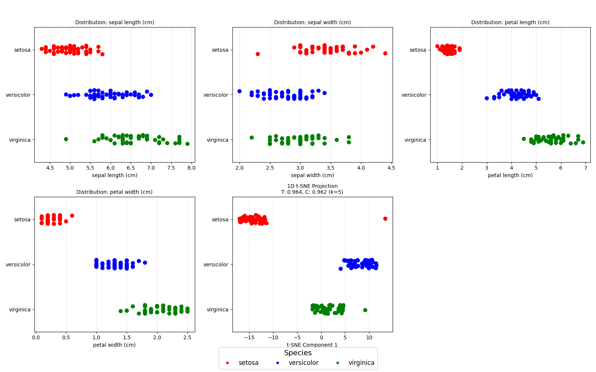
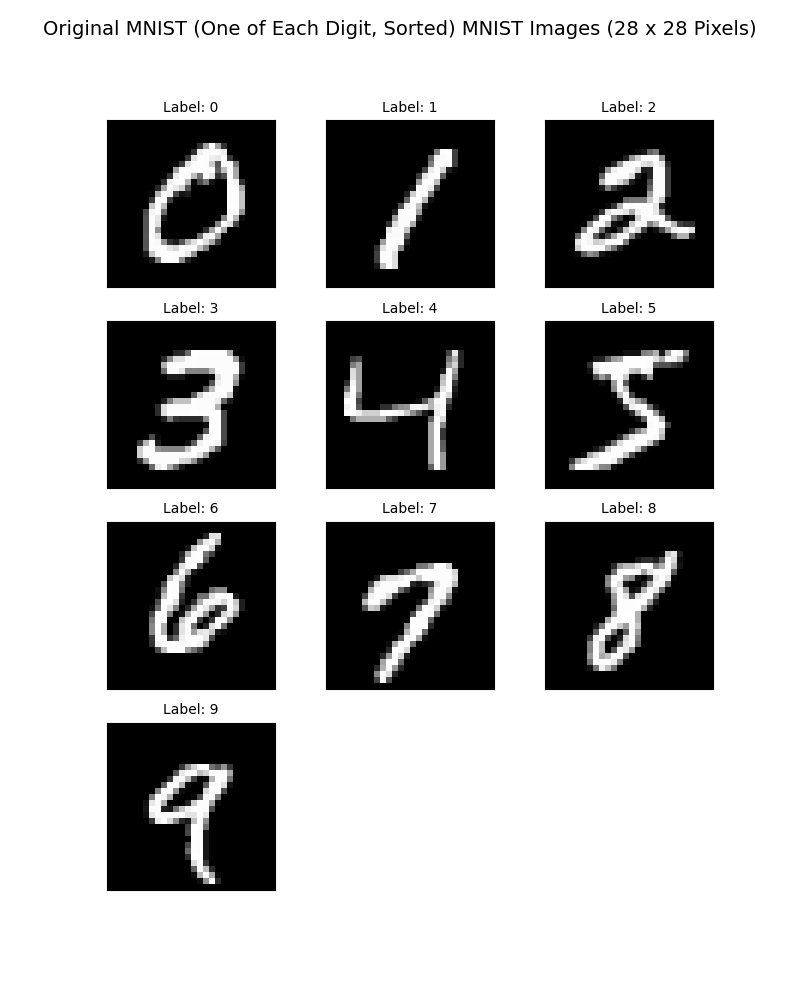
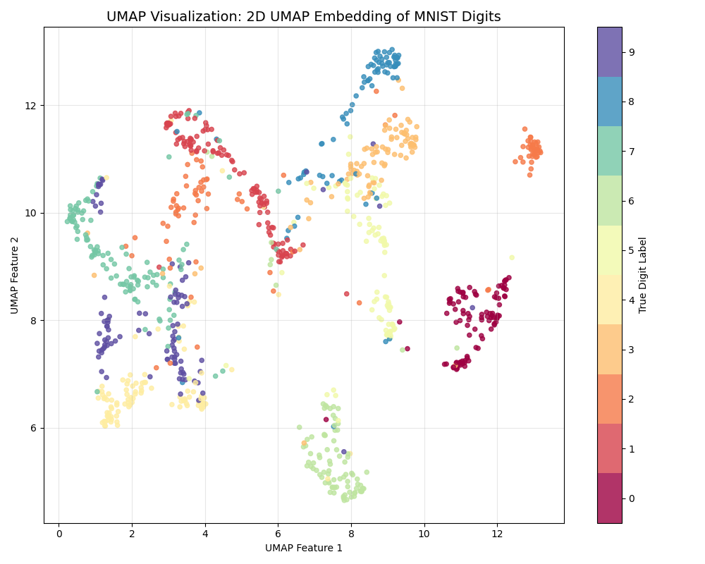

# Assortment of Mini ML Projects

A growing collection of **mini machine learning projects**, each focused on a key ML algorithm or concept — **regression, classification, clustering, and dimensionality reduction** — using real-world datasets.

Each project is **self-contained**, **beginner-friendly**, and ideal for **hands-on learning** and **portfolio building**.

---

## Repository Overview
### Folders
- **`Datasets/`** – All datasets used across projects. 
- **`output/`** – Saved plots and models.

---

## Regression Projects

### 1. Linear Regression
| Project | Feature | Target | Goal |
|--------|---------|--------|------|
| `LinearRegression Automobile Dataset.py` | `horsepower` | `price` | Predict car price |
| `LinearRegression Bengaluru Housing Data.py` | `total_sqft` | `price` | Predict house price |
| `LinearRegression Heart Disease Dataset.py` | `bmi` | `chol` | Predict cholesterol from BMI |

*Scatter + fitted line (Automobile dataset)*

---

### 2. Polynomial Regression
| Project | Feature | Target | Goal |
|--------|---------|--------|------|
| `Polynomial Regression Automobile Dataset.py` | `horsepower` | `price` | Capture non-linear price trends |
| `Polynomial Regression Bengaluru Housing Data.py` | `total_sqft` | `price` | Model non-linear housing trends |
| `Polynomial Regression Heart Disease Dataset.py` | `bmi` | `chol` | Fit non-linear BMI-cholesterol |

*Degree-14 polynomial curve on horsepower vs price*

---

### 3. Multiple Linear Regression — *Concrete Compressive Strength*
- **`MultipleLinearRegression Concrete Dataset.py`**
  - **Dataset:** `concrete_data.csv`
  - **Goal:** Predict **concrete compressive strength** from 8 material components.

> **Before vs After:** Polynomial features + removing weak predictors (`blast_furnace_slag`, `fly_ash`) 
> **improved R² from 62.8% → 76.3% (+13.5%)** and **reduced MSE from 96 → 61 (-36%)**.

---
### 4. Ridge Regression (L2 Regularization) — *Concrete Compressive Strength*
- **`Ridge_Regression_Concrete.py`**
- **Dataset:** `concrete_data.csv`
- **Goal:** Apply L2 regularization to handle multicollinearity and prevent overfitting.

#### 📊 Model Performance Comparison
This table compares the Ordinary Least Squares (OLS) model ($\alpha=0.0$), the optimized Ridge model ($\alpha=1.0$), and a highly penalized model ($\alpha=1000$). The best model is chosen based on the lowest Mean Squared Error (MSE).

| Model Type / Alpha   |    MSE |    R² |
|:---------------------|-------:|------:|
| 0.0 (OLS)            |  95.97 | 0.628 |
| 1.0 (Best Ridge)     |  95.97 | 0.628 |
| 1000 (Max Penalty)   | 148.04 | 0.425 |

#### 📈 Coefficient Shrinkage Analysis
Ridge regression shrinks the magnitude of the coefficients towards zero as the regularization strength ($\alpha$) increases. Note how coefficients like `cement` and `blast_furnace_slag` are dramatically reduced in the Max Penalty model.

| Feature            |   OLS ($\alpha=0.0$) |   Best Ridge ($\alpha=1.0$) |   Max Penalty ($\alpha=1000$) |
|:-------------------|--------------:|---------------------:|-----------------------:|
| Intercept          |       35.8579 |              35.8579 |                35.8579 |
| cement             |       12.7884 |              12.5615 |                 3.3868 |
| blast_furnace_slag |        9.4345 |               9.2151 |                 1.3524 |
| fly_ash            |        5.2546 |               5.0605 |                -0.7015 |
| water              |       -2.8826 |              -3.0296 |                -2.1586 |
| superplasticizer   |        1.8521 |               1.8537 |                 2.2396 |
| coarse_aggregate   |        1.4052 |               1.2535 |                -1.0108 |
| fine_aggregate     |        1.9505 |               1.7549 |                -1.2425 |
| age                |        7.0374 |               7.0185 |                 2.7131 |

#### 🖼️ Visualizations

**1D PCA Projection with Regression Lines**
*Shows how the OLS and Ridge models fit the single most important principal component.*

**Performance vs. Alpha (Regularization Strength)**
*Illustrates the trade-off between bias and variance, showing MSE and $R^2$ changes as $\alpha$ increases.*

> **Key Findings:**
> * **Best Performance:** The optimal Ridge model ($\alpha=1.0$) achieved a minimal MSE of $95.97$ and $R^2$ of $0.628$, marginally outperforming OLS.
> * **Shrinkage Effect:** The coefficient for `cement` dropped from $12.79$ (OLS) to $3.39$ (Max Penalty), and `fly_ash` changed signs, demonstrating significant regularization.
> * **Over-Regularization:** A high penalty ($\alpha=1000$) leads to severe underfitting, degrading performance with an MSE of $148.04$ and $R^2$ of $0.425$.

---

## Classification Projects

### 5. Decision Trees (DT)
| Project | Goal |
|--------|------|
| `DT Drug200.py` | Classify drug type |
| `DT diabetes.py` | Predict diabetes |

**Decision Tree**

**Feature Importance Ranking** (most → least important) 

> **Key insight:** `Glucose` is the dominant splitter, followed by `BMI`, `Age`, etc.

---

### 6. Random Forest (RF)
| Project | Goal |
|--------|------|
| `RF Drug200.py` | Ensemble drug classification |
| `RF diabetes.py` | Ensemble diabetes prediction |

**Feature Importance (100 trees)**

> **Top 3:** `Glucose` > `BMI` > `Age` — same pattern as DT, but more stable

---

### 7. Support Vector Machine (SVM)
- **`SVM BreastCancer.py`** – kernels `linear`, `poly`, `rbf`

**Kernel Comparison**

**2D PCA (Best Model)**

**3D PCA View**

> **Legend:** Blue = Benign | Orange = Malignant 
> **Best:** `SVM Linear` → ~95% accuracy

---

### 8. K-Nearest Neighbors (KNN)
- **`KNN Iris&Customer.py`**

**Iris Classification**

**Customer Gender Prediction**

> **Legend:** Blue = Setosa/Male | Orange = Versicolor/Female | Green = Virginica 
> **Iris:** ~100% | **Gender:** ~60% (challenging overlap)

---

### 9. Logistic Regression — *Bank Customer Churn*
- **`LogisticRegression Bank Customer Churn.py`**

**Confusion Matrix**

**ROC Curve**

**Feature Importance (Coefficients)**

> **Accuracy:** `81.60%` | **AUC:** `0.744` 
> **Top churn driver:** `country` (strongest positive coefficient) 
> **Strongest protector:** `active_member` (biggest negative coefficient)

---

## Clustering Projects

### 10. K-Means — *Mall Customer Segmentation*
- **`Kmeans Mall Customers.py`**

**Elbow Plot (k = 1–99)** 

**Customer Clusters (k = 8)** 

> **Detected optimal k = 8** via automated elbow method 
> 8 distinct customer groups identified 
> Centroids shown as **black X**

---

### 11. Hierarchical Clustering (HC) — *Mall Customer Segmentation*
- **`HierarchicalClustering Mall Customers.py`**

This project provides a comprehensive analysis of customer segmentation using **Hierarchical Clustering (HC)**. A rigorous hyperparameter search was performed, comparing 3 different distance metrics and 4 linkage methods to determine the optimal clustering configuration.

#### 📌 Optimal Configuration Summary

A systematic search across $k \in [2, 10]$, 3 distance metrics, and 4 linkage methods was performed. The configuration yielding the highest Silhouette Score was chosen as the optimal model.

| Parameter | Best Result | Configuration | Score |
| :--- | :--- | :--- | :--- |
| **Optimal Clusters ($k$)** | **6** | **Cosine + Average** | **0.7033** |
| **Best Distance Metric** | Cosine | | |
| **Best Linkage Method** | Average | | |

#### 📊 Performance Comparison: Silhouette Score

The bar plot below illustrates the Silhouette Score for the three primary linkage methods (Single, Complete, Average) combined with three distance metrics across the range of cluster counts ($k=2$ to $k=10$).

**Visualizing the Optimal $k$ Search:**

---

#### 📈 Comprehensive $3 \times 3$ Cluster Comparison ($k=6$)

To visualize the dramatic effect of hyperparameters, we fixed the number of clusters at the optimal value ($k=6$) and generated a $3 \times 3$ grid comparing all combinations of Distance Metrics (Rows: Euclidean, Manhattan, Cosine) and Linkage Methods (Columns: Single, Complete, Average).

##### 1. Dendrogram Analysis (3x3 Grid)

These plots show the hierarchy of cluster formation. Note the differences in cluster height and shape, particularly the "chaining" behavior evident in Single Linkage plots.

##### 2. 3D Cluster Visualization (3x3 Grid)

These scatter plots show the **six** clusters in the 3D feature space (Age, Annual Income, Spending Score) as grouped by each parameter combination.

##### 3. Heatmap Visualization (9 Separate Clustermaps)

The clustered heatmaps show the scaled customer features. Customers are reordered based on the dendrogram structure for each specific metric/linkage combination, allowing for visual inspection of the feature values within the resulting clusters.

| Euclidean / Single | Euclidean / Complete | Euclidean / Average |
| :---: | :---: | :---: |
|  |  |  |
| **Manhattan / Single** | **Manhattan / Complete** | **Manhattan / Average** |
|  |  |  |
| **Cosine / Single** | **Cosine / Complete** | **Cosine / Average** |
|  |  |  |

---

### 12. DBSCAN — *Wine Clustering with Hyperparameter Tuning*
- **`DBSCAN_WineData.py`**

This project performs **comprehensive density-based clustering** on the Wine dataset using DBSCAN with exhaustive hyperparameter tuning across **three evaluation metrics**: Silhouette Score, Calinski-Harabasz Score, and Davies-Bouldin Score.

#### 📌 Optimal Configurations Found

| Optimization Metric | Best ε | Best M | Score |
| :--- | :--- | :--- | :--- |
| **Silhouette Max** | 2.884 | 19 | 0.2353 |
| **Calinski-Harabasz Max** | 2.784 | 16 | 35.1 |
| **Davies-Bouldin Min** | 1.584 | 5 | 1.3873 |
| **Elbow (Sil M)** | 3.426 | 19 | — |
| **Elbow (CH M)** | 3.220 | 16 | — |
| **Elbow (DB M)** | 2.765 | 5 | — |
| **Final Consensus (Avg ε)** | 2.777 | 19 | — |

#### 📊 Triple Heatmap Visualization

The heatmaps show DBSCAN performance across the parameter space. Each cell represents a unique (ε, min_samples) combination, colored by the evaluation metric. Optimal combo positions are outlined:

**With Custom Combo (ε=2.58, M=10):**

#### 📈 K-Distance Elbow Plot

The k-distance graph shows the distance to the k-th nearest neighbor for each point. The "elbow" indicates a suitable ε value. Multiple ε thresholds from different optimization strategies are overlaid:

#### 🔍 PCA Scree Plot

Shows cumulative explained variance across principal components. PCA-3, PCA-5, and PCA-10 are highlighted:

| PC | Individual Variance | Cumulative Variance |
| :--- | :--- | :--- |
| 1 | 36.2% | 36.2% |
| 2 | 19.2% | 55.4% |
| 3 | 11.1% | 66.5% ⭐ |
| 4 | 7.1% | 73.6% |
| 5 | 6.6% | 80.2% ⭐ |
| ... | ... | ... |
| 10 | 1.9% | 96.2% ⭐ |

#### 🎯 3D Cluster Visualization (8 Combinations)

Each subplot shows the clustering result in 3D PCA space for different (ε, min_samples) combinations. Noise points are marked separately:

| Combo | Clusters | Noise Points |
| :--- | :--- | :--- |
| Silhouette Max | 2 | 20 |
| Calinski-Harabasz Max | 2 | 24 |
| Davies-Bouldin Min | 3 | 162 |
| Elbow (Sil M) | 1 | 9 |
| Elbow (CH M) | 1 | 9 |
| Elbow (DB M) | 1 | 17 |
| Final Consensus (Avg ε) | 2 | 27 |
| Custom Combo (ε=2.58, M=10) | 2 | 28 |

> **Key Insight:** Trade-off between number of clusters and noise points. Stricter parameters (lower ε, lower M) produce more clusters but more noise. Consensus approach balances both.

---

## Dimensionality Reduction

### 13. Principal Component Analysis (PCA)
- **`PCA Wine.py`**

**Explained Variance** 

**2D PCA Projection** 

> Reduced **11 → 2** features 
> Captures **99.5%** of total variance 
> Excellent compression with minimal information loss

---
### 14. t-SNE Analysis on Iris Dataset

This section demonstrates the use of t-distributed Stochastic Neighbor Embedding (t-SNE) to visualize the 4-dimensional Iris dataset in 3D, 2D, and 1D space, along with quantitative measures of the local structure preservation.

We use **Trustworthiness (T)** and **Continuity (C)** metrics (with $k=5$ nearest neighbors) to evaluate the quality of the dimensionality reduction.

### Quality Metrics Summary

The maximum score for both metrics is 1.0, indicating perfect preservation of local structure.

| Embedding Dimension | Trustworthiness (T) | Continuity (C) |
| :--- | :--- | :--- |
| **3D t-SNE** | $0.9962$ | $0.9969$ |
| **2D t-SNE** | $0.9881$ | $0.9893$ |
| **1D t-SNE** | $0.9602$ | $0.9629$ |

### 3D t-SNE Visualization

The 3D projection maintains almost perfect preservation of the original local neighborhood structure. The t-SNE plot (bottom right) clearly separates the three species compared to the raw feature combinations.

### 2D t-SNE Visualization

The 2D projection is highly effective, showing excellent separation while retaining high scores for local structure.

### 1D t-SNE Visualization

Reducing the data to a single dimension causes a slight loss in local fidelity (as shown by the lower scores), but the plot still effectively demonstrates the separation of *Setosa* from the other two species.

---
### 15. UMAP Analysis on MNIST Digits
- **`UMAP_MNIST.py`**

This project uses **UMAP (Uniform Manifold Approximation and Projection)** to visualize the structure of the high-dimensional MNIST handwritten digits dataset. The goal is to reduce the data from 784 dimensions down to 2 dimensions for topological visualization.

#### 🖼️ Output Visualizations

**1. Original Input Grid (Sorted)**

| Filename | Description |
| :--- | :--- |
| `UMAP_original_28x28_mnist_unique_sorted.png` | A grid showing one sample of each digit (0 through 9) in sorted order to confirm the input data. |

**2. UMAP 2D Embedding Result**

| Filename | Description |
| :--- | :--- |
| `UMAP_2d_visualization_mnist.png` | **Core Visualization:** A scatter plot of 1000 MNIST digits reduced to 2D. Points are colored by their true digit label, demonstrating UMAP's ability to create well-separated clusters for each digit class. |

#### 📋 Technical Details

| Detail | Value |
| :--- | :--- |
| **Dataset Used** | MNIST (1000 samples) |
| **Original Dimension** | 784 features ($28 \times 28$ pixels) |
| **UMAP Target Dimension** | 2 features (for visualization) |
| **UMAP Hyperparameters** | `n_neighbors=15`, `min_dist=0.1`, `metric='euclidean'` |

> **Key Insight:** UMAP successfully preserves the high-dimensional topological relationships, resulting in 10 distinct and tightly-grouped clusters in 2D space, corresponding perfectly to the 10 handwritten digits.

---

## Project Statistics

| Category | Count | Algorithms |
| :--- | :--- | :--- |
| **Regression** | 4 | Linear, Polynomial, Multiple, Ridge |
| **Classification** | 5 | DT, RF, SVM, KNN, Logistic Reg |
| **Clustering** | 3 | K-Means, Hierarchical, DBSCAN |
| **Dimensionality Reduction** | 3 | PCA, t-SNE, UMAP |
| **Total Projects** | **15** | — |

---

## 📝 License
This project is licensed under the MIT License — see the LICENSE file for details.

---

## 🤝 Contributing
Contributions are welcome! Feel free to fork, improve, and submit pull requests.
